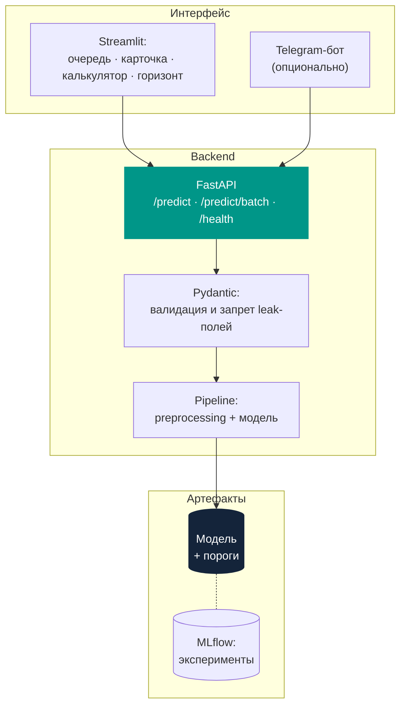

# Cancel Alert · требования к сервису

- **Версия:** 0.1
- **Статус:** черновик
- **Дата:** 06.10.2026

Спецификация сервиса оценки риска отмены брони. Продуктовое описание и план работ: [README](../README.md).

> [!IMPORTANT]
> Это рабочий документ, а не финальные требования. Часть решений принята до знакомства с данными и до согласования с куратором, поэтому будет уточняться. Непроверенные места помечены словом **предварительно**, все открытые вопросы собраны в разделе [Открытые вопросы](#открытые-вопросы).
>
> Версию поднимаем после каждого чекпоинта, который закрывает хотя бы один открытый вопрос.

- [Функциональные требования](#функциональные-требования)
- [Архитектура](#архитектура)
- [Контракт API](#контракт-api)
- [Поля на входе](#поля-на-входе)
- [Пороги риска](#пороги-риска)
- [Нефункциональные требования](#нефункциональные-требования)
- [Ограничения](#ограничения)
- [Открытые вопросы](#открытые-вопросы)

## Функциональные требования

Столбец "Источник" показывает, что можно пересматривать: требования программы зафиксированы, решения команды могут измениться.

| № | Требование | Срок | Источник |
|:---|:---|:---|:---|
| FR-1 | Вероятность отмены по одной броне | ЧП4 | программа |
| FR-2 | Уровень риска для брони: низкий / средний / высокий | ЧП4 | программа |
| FR-3 | Валидация входных данных с понятным сообщением об ошибке | ЧП4 | программа |
| FR-4 | Запрет полей, недоступных в момент бронирования | ЧП4 | программа |
| FR-5 | Батч-оценка списка броней | ЧП4 | решение команды |
| FR-6 | Объяснение прогноза: 3-5 факторов с направлением влияния | ЧП5 | программа |
| FR-7 | Очередь броней с сортировкой и фильтрами | ЧП5 | решение команды |
| FR-8 | Ожидаемые отмены по датам заезда | ЧП5 | решение команды |
| FR-9 | Калькулятор "что если" | ЧП5 | решение команды |
| FR-10 | Экран качества модели с калибровочной кривой | ЧП7 | решение команды |
| FR-11 | Дневной дайджест в телеграм | опционально | решение команды |

## Архитектура

Preprocessing и модель сохраняются **единым pipeline**. Иначе расчёт признаков в ноутбуке и в сервисе разойдётся, и прогноз на продакшене перестанет совпадать с тестовым.

FastAPI обязателен по требованию ЧП4. Streamlit как интерфейс и телеграм-бот как канал уведомлений: **предварительно**, выбор подтверждаем на ЧП4.

## Поля на входе

Сервис принимает только сведения, существующие **в момент подтверждения брони**: тип отеля, дату заезда и длительность, lead time, состав гостей, питание, страну, сегмент и канал продаж, историю гостя, тип номера, тип депозита, тип клиента, тариф, парковку, специальные пожелания.

Эти поля заполняются или меняются позже, поэтому в сервис не передаются:

| Поле | Почему исключено | Статус |
|:---|:---|:---|
| `reservation_status` | содержит сам ответ | подтверждено |
| `reservation_status_date` | содержит сам ответ | подтверждено |
| `assigned_room_type` | известно при заселении | на согласовании |
| `booking_changes` | накапливается после брони | на согласовании |
| `days_in_waiting_list` | накапливается после брони | на согласовании |

## Нефункциональные требования

| № | Требование | Статус |
|:---|:---|:---|
| NFR-1 | Ответ `/predict`: до 1 секунды на одну бронь | предварительно, не измерялось |
| NFR-2 | Батч до 1000 броней: до 10 секунд | предварительно, не измерялось |
| NFR-3 | Вероятности калиброваны: заявленные 70% означают примерно 70% отмен на практике | цель, достижимость проверим на ЧП7 |
| NFR-4 | Воспроизводимость: фиксированный `random_state`, версии зависимостей, логирование в MLflow | подтверждено |
| NFR-5 | Валидация диапазонов и типов на входе, тесты на pytest | подтверждено |
| NFR-6 | Персональные данные не обрабатываются | подтверждено |
| NFR-7 | Версия модели и набор порогов видны в каждом ответе | подтверждено |

Пороги в NFR-1 и NFR-2 взяты как разумные ориентиры для табличной модели. Замеряем на ЧП4 и правим по факту.

## Ограничения

- Модель обучена на двух португальских отелях за 2015-2017 годы. Переносимость на другие отели и годы не проверялась и не заявляется.
- Живого потока броней нет. Для демонстрации используется **режим воспроизведения**: отложенная часть данных проигрывается по дням, как будто брони поступают сейчас. В реальной эксплуатации на это место встаёт PMS отеля.
- Сервис оценивает риск, но не измеряет эффект вмешательства: данных об откликах на звонки и письма в датасете нет.

## Открытые вопросы

| Вопрос | Когда решаем | Что изменится |
|:---|:---|:---|
| Входят ли неявки (`No-Show`) в целевую переменную `is_canceled` | ЧП2 | формулировка задачи, состав выборки |
| Исключаем ли `assigned_room_type`, `booking_changes`, `days_in_waiting_list` | ЧП2, с куратором | таблица полей на входе, схема запроса |
| Точная схема запроса: типы, пропуски, нужны ли `agent` и `company` | ЧП2 | контракт API |
| Основная метрика: ROC-AUC, PR-AUC или Recall отмен | ЧП3 | раздел метрик в README |
| Хватает ли сигнала после отсева утечек и хронологического сплита | ЧП3 | вся продуктовая часть: при слабой модели очередь риска теряет смысл |
| Streamlit или другой интерфейс | ЧП4 | архитектура |
| Реальная задержка `/predict` и батча | ЧП4 | NFR-1, NFR-2 |
| Конкретные значения порогов и допущения о стоимости вмешательства | ЧП5 | пороги риска, пример ответа API |
| Достижима ли калибровка нужного качества | ЧП7 | NFR-3 |

## История версий

| Версия | Дата | Что изменилось |
|:---|:---|:---|
| 0.1 | 06.10.2026 | Первая версия: продуктовое видение превращено в требования. Открытые вопросы не закрыты. |
